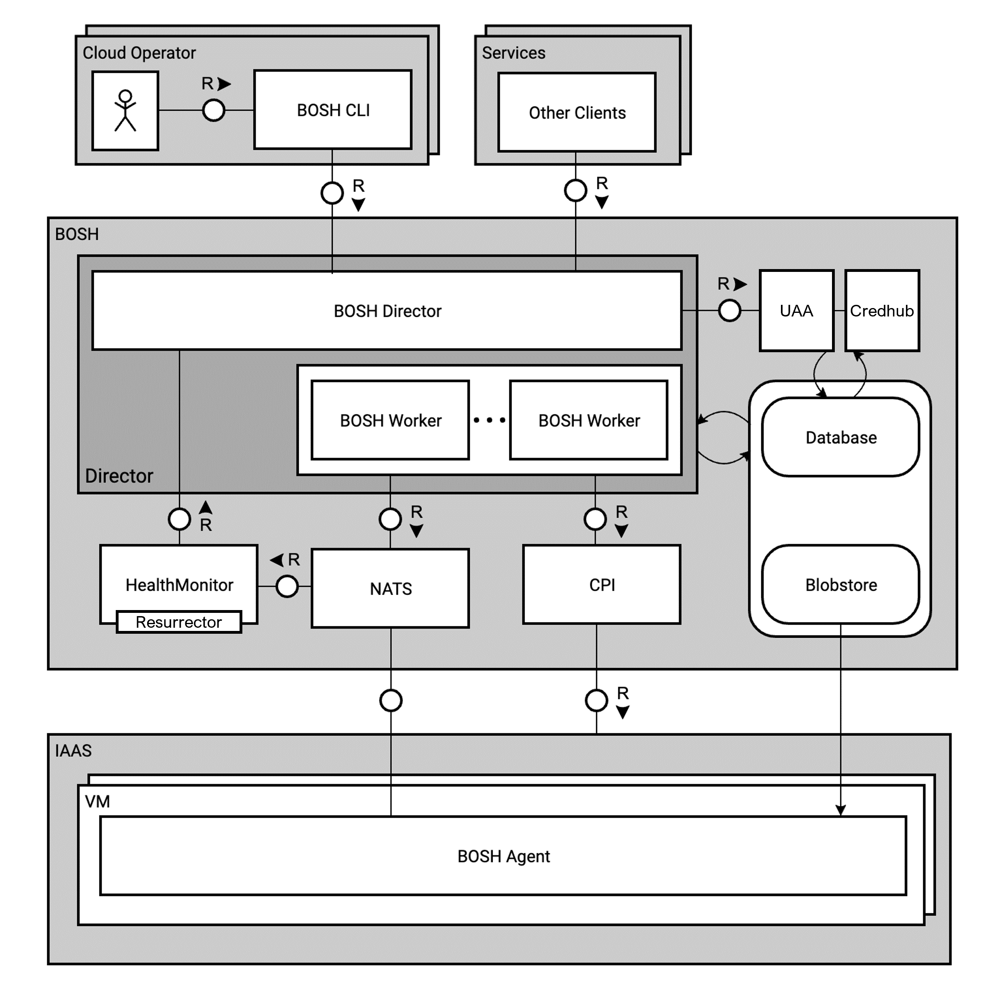

### [Index](https://github.com/okpc579/paasta-guide-new/blob/main/README.md) > [AP Architecture](../README.md) > BOSH

## 목적
본 문서는 BOSH의 Architecture를 제공한다.
  

## 시스템 구성도

 

| Deployment |  스펙 |
|------------|------|
| BOSH | 4vCPU / 16GB RAM / (25GB + 64GB) 추가 디스크 |

  

## 설명
BOSH는 초기에 Cloud Foundry PaaS를 위해 개발되었지만, 현재는 Jenkins, Hadoop 등 Yaml 파일 형식으로 소프트웨어를 쉽게 배포할 수 있으며, 수백 가지의 VM을 설치할 수 있고, 각각의 VM에 대해 모니터링, 장애 복구 등 라이프 사이클을 관리할 수 있는 통합 프로젝트이다.  
BOSH가 지원하는 IaaS는 VMware vSphere, Google Cloud Platform, Amazon Web Services EC2, Microsoft Azure, OpenStack, Alibaba Cloud가 있다.
PaaS-TA AP BOSH는 VMware vSphere, Google Cloud Platform, Amazon Web Services EC2, OpenStack, Microsoft Azure 등의 IaaS를 지원한다.

이하는 BOSH 구성요소 설명이다.
- Command Line Interface (CLI) : CLI는 BOSH에 대한 기본 명령어 인터페이스이다.  
오퍼레이터는 CLI를 사용하여 Director와 상호 작용하여 작업을 수행한다.

- Director: Director는 VM 생성 또는 수정 시 설정 정보를 레지스트리에 저장한다.  
저장된 레지스트리 정보는 VM의 Bootstrapping Stage에서 이용된다.

- Cloud Provider Interface (CPI) : CPI는 Director가 IaaS와 상호 작용 하여 Stemcell, VM, Disk를 생성하고 관리하는데 사용되는 API 이다.

- Health Monitor: Health Monitor는 Agent에서 수신한 상태 및 라이프사이클 이벤트를 사용하여 VM의 상태를 모니터링 한다.  
Health Monitor가 VM의 문제를 감지하면 알림 플러그인을 통하여 경고를 보내거나 Resurrector를 트리거 할 수 있다.
  - Resurrector : Resurrector가 사용 설정된 경우, Health Monitor에서 누락, 응답하지 않는다면 식별된 VM을 자동으로 다시 생성한다.

- Database : Database는 Dirctor가 사용하는 Postgres Database로, 배포의 상태, Stemcell, Release, Deployments의 메타데이터가 저장된다.

- Blobstore : Blobstore는 Release와 Release의 컴파일된 이미지가 저장된다.

- Agent : Agent는 BOSH를 통해 배포되는 모든 VM에 설치되고, Director로부터 특정 명령을 받고 수행하는 역할을 한다.  
Agent는 Director로부터 수신받은 Job Specification(설치할 패키지 및 구성 방법) 정보로 해당 VM에 Director의 지시대로 지정된 패키지를 설치하고, 필요한 구성 정보를 설정한다.

- Message Bus (NATS) : NATS는 Director와 Agent 간 통신을 위한 Publish-Subscribe 방식의 Message System으로, VM 모니터링과 특정 명령을 수행하기 위해 사용된다.

- UAA: BOSH 사용자 인증 인가 처리를 한다.

- Credhub : BOSH를 통해 만들어지는 certification과 password등의 인증정보를 관리한다.

  

## 참고자료
BOSH Document: [http://bosh.io](http://bosh.io)  
BOSH Deployment: [https://github.com/cloudfoundry/bosh-deployment](https://github.com/cloudfoundry/bosh-deployment)  

### [Index](https://github.com/okpc579/paasta-guide-new/blob/main/README.md) > [AP Architecture](../README.md) > BOSH
