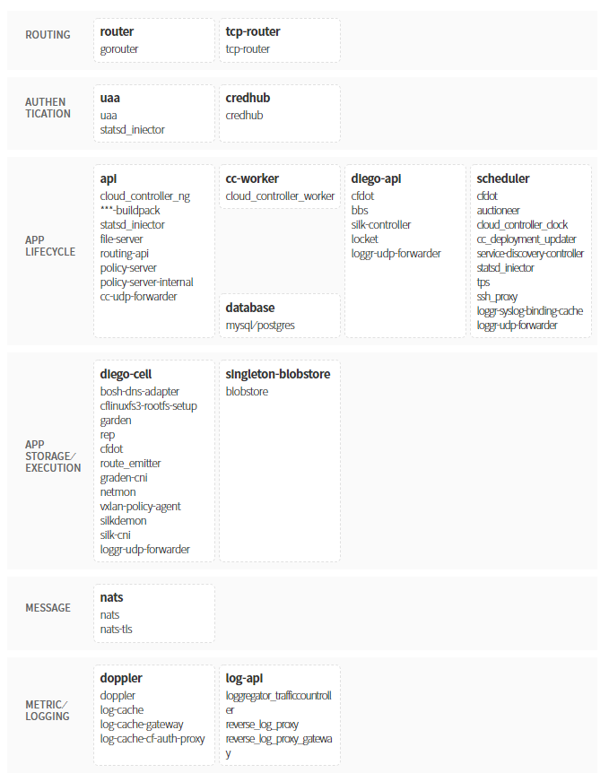

### [Index](https://github.com/PaaS-TA/Guide/blob/master/README.md) > [AP Architecture](../README.md) > PaaS-TA AP

## 목적
본 문서는 PaaS-TA Application Platform (AP)의 Architecture를 제공한다.
  

## 시스템 구성도

| 구분  | 인스턴스 수| 스펙 |
|-------|----|-----|
| api | N | 1vCPU / 2GB RAM / 50GB 추가 디스크 |
| cc-worker | N | 1vCPU / 2GB RAM |
| credhub | N | 1vCPU / 2GB RAM |
| database | 1(PostgreSQL) or N(MySQL) | 1vCPU / 2GB RAM / 10GB 추가 디스크 |
| diego-api | N | 1vCPU / 2GB RAM |
| diego-cell | N | 4vCPU / 16GB RAM / 100GB 추가 디스크 |
| doppler | N | 1vCPU / 2GB RAM |
| haproxy | 1 | 1vCPU / 2GB RAM |
| nats | N | 1vCPU / 2GB RAM |
| router | N | 1vCPU / 2GB RAM |
| scheduler | N | 1vCPU / 2GB RAM |
| singleton-blobstore | 1 | 1vCPU / 2GB RAM / 100GB 추가 디스크 |
| tcp-router | N | 1vCPU / 2GB RAM |
| uaa | N | 1vCPU / 2GB RAM |

## 설명
PaaS-TA AP는 개발자 프레임워크 및 앱 서비스를 선택할 수 있는 PaaS(Platform as a Service) 플랫폼이다.  
PaaS-TA AP를 사용하면 어플리케이션을 더 빠르고 쉽게 구축, 테스트 배포 및 확장할 수 있다.

### [Index](https://github.com/PaaS-TA/Guide/blob/master/README.md) > [AP Architecture](../README.md) > PaaS-TA AP
