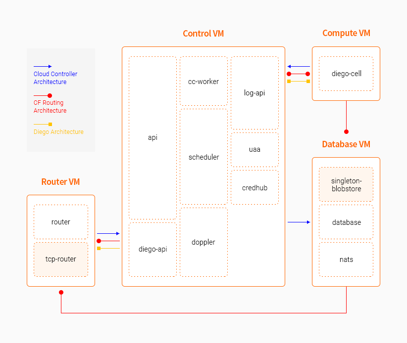

### [Index](https://github.com/PaaS-TA/Guide/blob/master/README.md) > [AP Architecture](../README.md) > PaaS-TA AP - min

## 목적
본 문서는 PaaS-TA Application Platform (AP) - min의 Architecture를 제공한다. 
 
PaaS-TA Application Platform (AP) - min 은 Application Platform의 경량화 버전이다. 
  

## 시스템 구성도

- 4VM 배포 시

| 구분  | 인스턴스 수| 스펙 |
|-------|----|-----|
| compute | N | 4vCPU / 16GB RAM / 100GB 추가 디스크 |
| control | N | 4vCPU / 16GB RAM / 30GB 추가 디스크 |
| database | 1 | 1vCPU / 2GB RAM / 100GB 추가 디스크 |
| router | 1 | 1vCPU / 2GB RAM |

- 7VM 배포 시

| 구분  | 인스턴스 수| 스펙 |
|-------|----|-----|
| compute | N | 4vCPU / 16GB RAM / 100GB 추가 디스크 |
| control | N | 4vCPU / 16GB RAM / 30GB 추가 디스크 |
| database | 1(PostgreSQL) or N(MySQL) | 1vCPU / 2GB RAM / 10GB 추가 디스크 |
| haproxy | 1 | 1vCPU / 2GB RAM |
| router | N | 1vCPU / 2GB RAM  |
| singleton-blobstore | 1 | 1vCPU / 2GB RAM / 100GB 추가 디스크 |
| tcp-router | N | 1vCPU / 2GB RAM |

## 설명
PaaS-TA AP - min은 PaaS-TA AP의 경량화 버전이다.  
기존 15~16VM 구성요소를 필요에 따라 4VM이나 7VM로 배포가 가능하다.

### [Index](https://github.com/PaaS-TA/Guide/blob/master/README.md) > [AP Architecture](../README.md) > PaaS-TA AP - min
