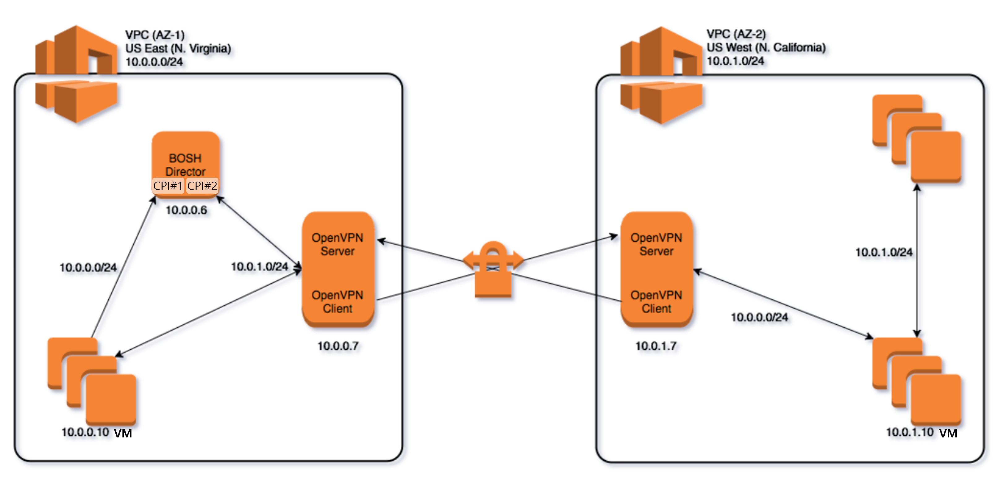

### [Index](https://github.com/PaaS-TA/Guide/blob/master/README.md) > [AP Architecture](../README.md) > PaaS-TA Multi CPI

## 목적
본 문서는 PaaS-TA Multi CPI의 Architecture를 제공한다.
  

## 시스템 구성도

 

| 구분  | 인스턴스 수| 스펙 |
|-------|----|-----|
| openvpn | 2 | 1vCPU / 0.5GB RAM |
| BOSH | 1 | 4vCPU / 16GB RAM / (25GB + 64GB) 추가 디스크 |

  

## 설명
하나의 BOSH Director를 통하여 BOSH가 설치된 IaaS 환경(Main IaaS AZ-1)과 BOSH가 설치되지 않은 다른 IaaS 환경(Second IaaS AZ-2)에 VM을 배포하고 관리한다.
이는 BOSH Director에 설치된 CPIs 통하여 Multi IaaS 환경을 컨트롤하게 된다.

## 참고자료
BOSH Document: [http://bosh.io](http://bosh.io)  
BOSH Deployment: [https://github.com/cloudfoundry/bosh-deployment](https://github.com/cloudfoundry/bosh-deployment)  

### [Index](https://github.com/PaaS-TA/Guide/blob/master/README.md) > [AP Architecture](../README.md) > PaaS-TA Multi CPI
