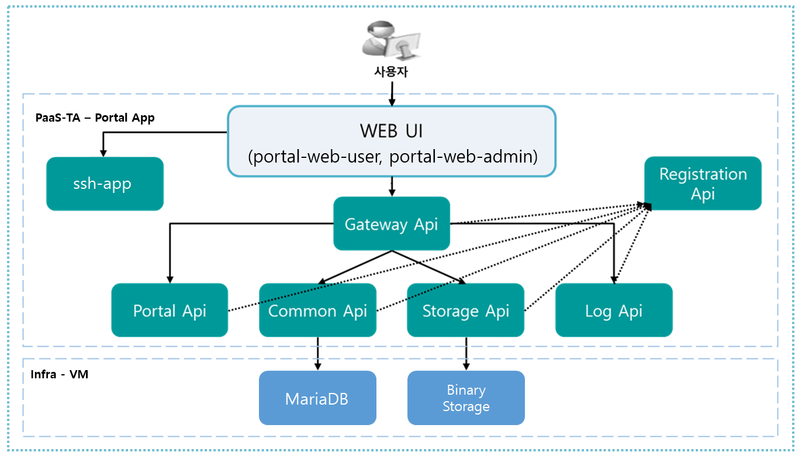

### [Index](https://github.com/PaaS-TA/Guide/blob/master/README.md) > [AP Architecture](../README.md) > Portal Container Type

## 목적
본 문서는 Application Platform (AP) Portal - Container Type의 Architecture를 제공한다.
  

## 시스템 구성도
Container Type의 AP Portal은 Portal Infra와 Portal APP으로 나뉘어있다.  
Portal Infra는 BOSH로 배포되고, Portal APP은 PaaS-TA AP로 배포된다.  
Portal Infra, Portal APP의 구성과 스펙은 다음과 같다.  
 

 

* Paas-TA Portal infra VM   

| 구분 | 스펙 |
|---------|-------|
| infra (mariadb / binary storage) | 1vCPU / 512MB RAM / 10GB Disk 20GB(영구적 Disk) |

* Paas-TA Portal App

| App명 | 인스턴스 수 | 메모리 | 디스크 |
|--------|-------|-------|-------|
| portal-registration | N | 1G | 1G|
| portal-gateway | N | 1G | 1G|
| portal-api | N | 2G | 2G|
| portal-common-api | N | 1G | 1G|
| portal-storage-api | N | 1G | 1G|
| portal-log-api | 1 | 1G | 1G|
| portal-web-admin | N | 1G | 1G|
| portal-web-user | N | 1G | 1G|  
| ssh-app | 1 | 1G | 1G|  

### [Index](https://github.com/PaaS-TA/Guide/blob/master/README.md) > [AP Architecture](../README.md) > Portal Container Type
