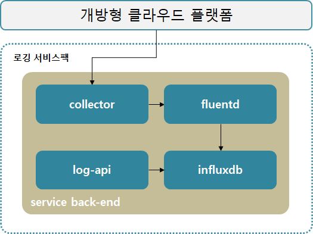

### [Index](https://github.com/okpc579/paasta-guide-new/blob/main/README.md) > [AP Architecture](../README.md) > Logging Service

## 목적
본 문서는 Application Platform (AP) - Logging Service의 Architecture를 제공한다.
  

## 시스템 구성도

 

| 구분  | 스펙 |
|-------|----|
| elasticsearch_master | 1vCPU / 2GB RAM / 10GB 추가 디스크 |
| queue | 1vCPU / 2GB RAM / 10GB 추가 디스크 |
| maintenance | 1vCPU / 2GB RAM |
| elasticsearch_data | 2vCPU / 4GB RAM / 20GB 추가 디스크 |
| visualization | 1vCPU / 2GB RAM |
| collector | 1vCPU / 2GB RAM |
| parser | 1vCPU / 2GB RAM |
| router | 1vCPU / 2GB RAM |

### [Index](https://github.com/okpc579/paasta-guide-new/blob/main/README.md) > [AP Architecture](../README.md) > Logging Service
