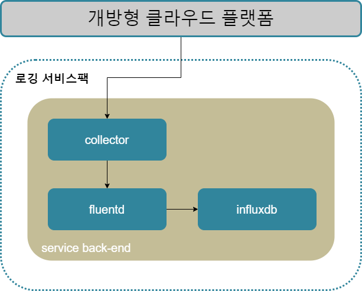

### [Index](https://github.com/PaaS-TA/Guide/blob/master/README.md) > [AP Architecture](../README.md) > Logging Service

## 목적
본 문서는 Application Platform (AP) - Logging Service의 Architecture를 제공한다.
  

## 시스템 구성도

 

| 구분  | 스펙 |
|-------|----|
| fluentd | 1vCPU / 4GB RAM |
| influxdb | 4vCPU / 8GB RAM / 10GB 추가 디스크 |
| collector | 1vCPU / 4GB RAM |

### [Index](https://github.com/PaaS-TA/Guide/blob/master/README.md) > [AP Architecture](../README.md) > Logging Service
