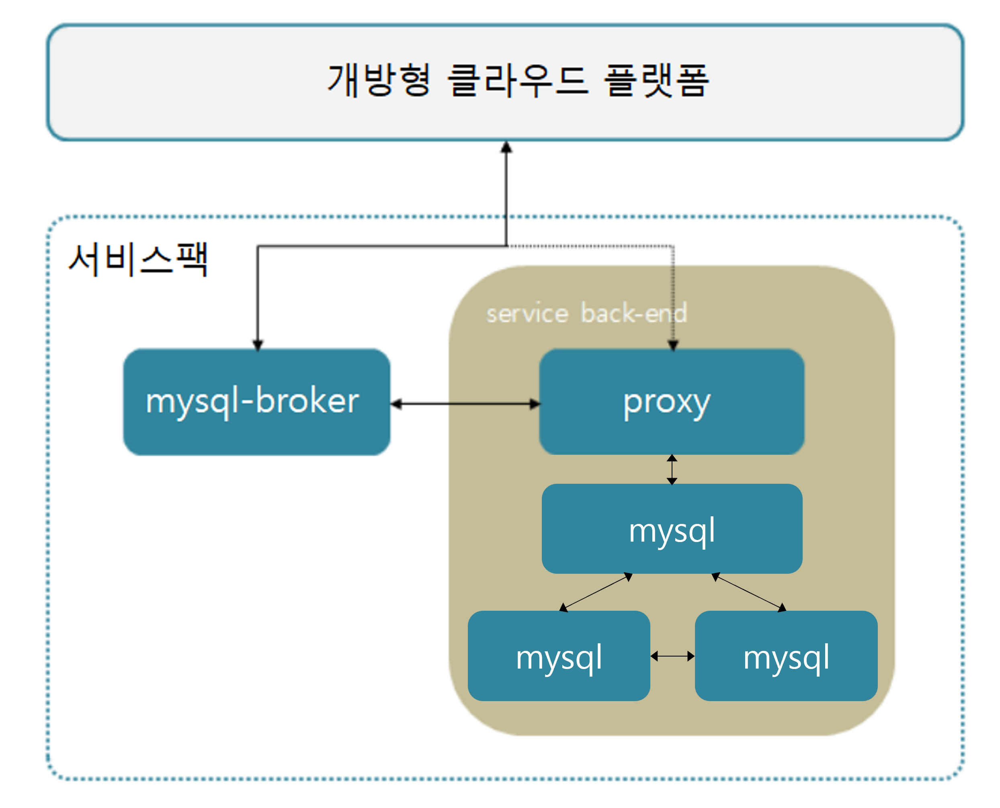

### [Index](https://github.com/PaaS-TA/Guide/blob/master/README.md) > [AP Architecture](../README.md) > MySQL Service

## 목적
본 문서는 Application Platform (AP) - MySQL Service의 Architecture를 제공한다.
  

## 시스템 구성도
MySQL Service는 Cloudfoundry가 공개하고 있는 MySQL Galera Bosh release를 기반으로 서비스를 구성한다.  
Galera Cluster Provider 는 Percona Xtradb Cluster 이다.  

 

 

| 구분  | 스펙 |
|-------|----|
| arbitrator | 1vCPU / 2GB RAM |
| mysql | 1vCPU / 2GB RAM / 8GB 추가 디스크 |
| mysql_broker | 1vCPU / 2GB RAM |
| proxy | 1vCPU / 2GB RAM |

### [Index](https://github.com/PaaS-TA/Guide/blob/master/README.md) > [AP Architecture](../README.md) > MySQL Service
