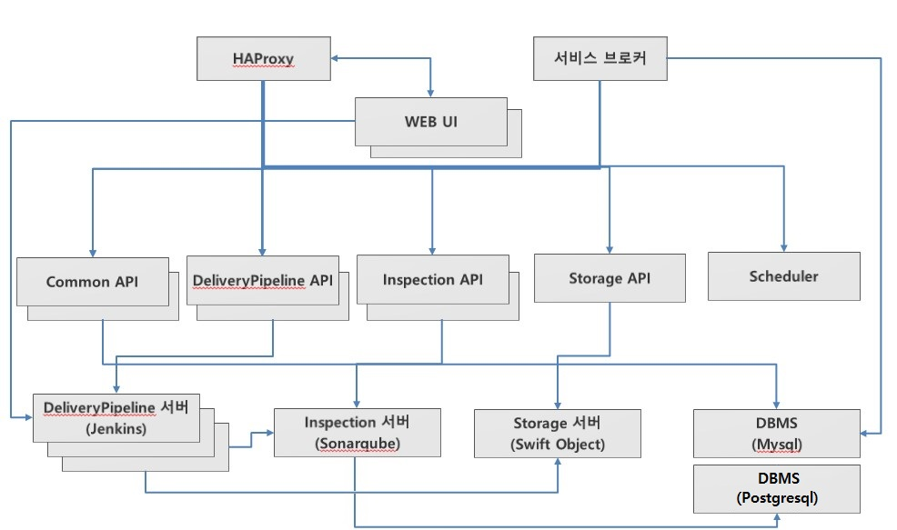

### [Index](https://github.com/okpc579/paasta-guide-new/blob/main/README.md) > [AP Architecture](../README.md) > Pipeline Service

## 목적
본 문서는 Application Platform (AP) - Pipeline Service의 Architecture를 제공한다.
  

## 시스템 구성도

 

| 구분 | 스펙 |
|-------|------|
| mariadb | 1vCPU / 2GB RAM / 2GB 추가 디스크 |
| postgres | 1vCPU / 2GB RAM / 2GB 추가 디스크 |
| inspection | 1vCPU / 2GB RAM |
| haproxy | 1vCPU / 2GB RAM |
| ci_server | 1vCPU / 2GB RAM / 5GB 추가 디스크 |
| binary_storage | 1vCPU / 2GB RAM / 5GB 추가 디스크 |
| delivery-pipeline-common-api | 1vCPU / 2GB RAM |
| delivery-pipeline-inspection-api | 1vCPU / 2GB RAM |
| delivery-pipeline-binary-storage-api | 1vCPU / 2GB RAM |
| delivery-pipeline-api | 1vCPU / 2GB RAM / 2GB 추가 디스크 |
| delivery-pipeline-service-broker | 1vCPU / 2GB RAM / 2GB 추가 디스크 |
| delivery-pipeline-ui | 1vCPU / 2GB RAM |
| delivery-pipeline-scheduler | 1vCPU / 2GB RAM |

### [Index](https://github.com/okpc579/paasta-guide-new/blob/main/README.md) > [AP Architecture](../README.md) > Pipeline Service
