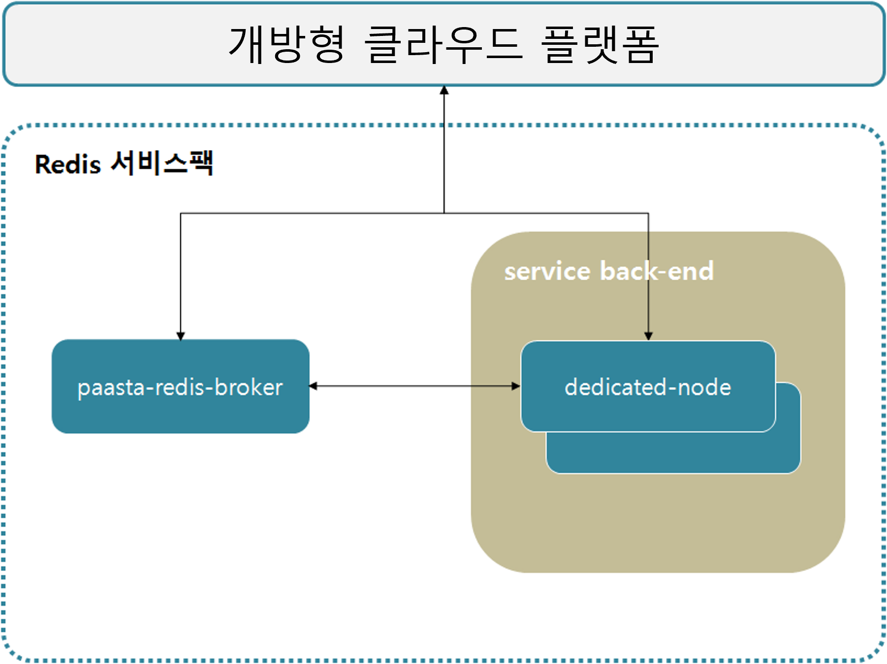

### [Index](https://github.com/okpc579/paasta-guide-new/blob/main/README.md) > [AP Architecture](../README.md) > Redis Service

## 목적
본 문서는 Application Platform (AP) - Redis Service의 Architecture를 제공한다.
  

## 시스템 구성도

 

| 구분  | 스펙 |
|-------|-----|
| mariadb | 2vCPU / 4GB RAM / 2GB 추가 디스크 |
| paas-ta-on-demand-broker | 2vCPU / 4GB RAM |
| redis | 2vCPU / 4GB RAM / 1GB 추가 디스크 |

### [Index](https://github.com/okpc579/paasta-guide-new/blob/main/README.md) > [AP Architecture](../README.md) > Redis Service
