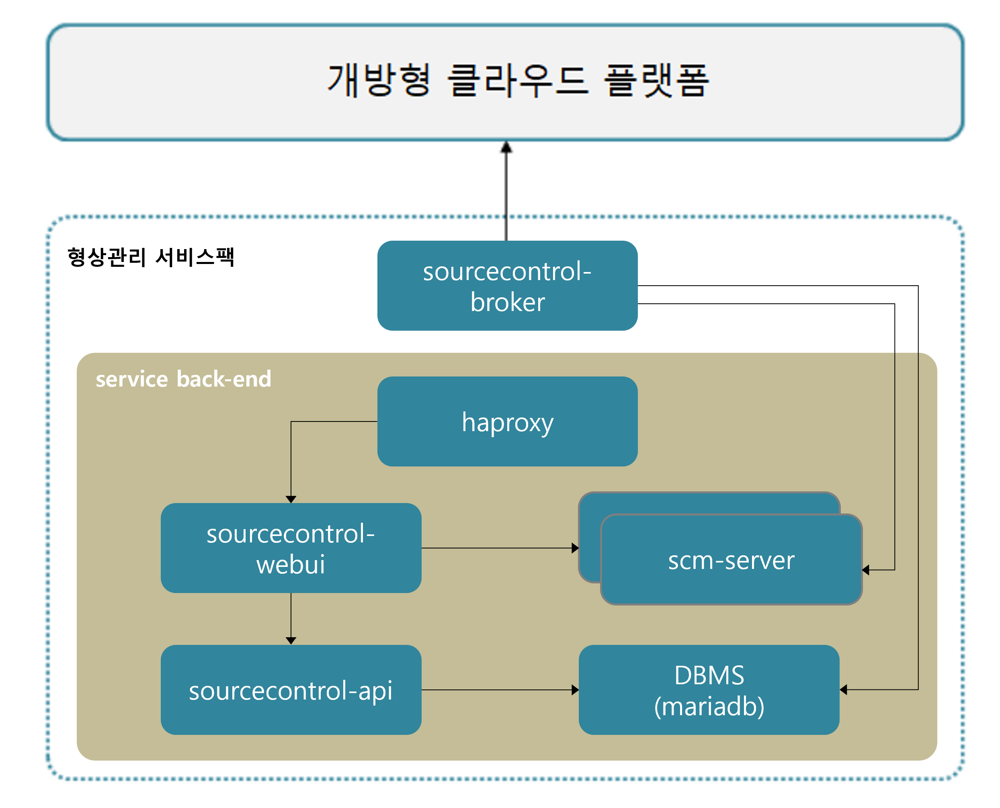

### [Index](https://github.com/PaaS-TA/Guide/blob/master/README.md) > [AP Architecture](../README.md) > Source Control Service

## 목적
본 문서는 Application Platform (AP) - Source Control Service의 Architecture를 제공한다.
  

## 시스템 구성도

 

| 구분  | 스펙 |
|-------|-----|
| scm-server | 1vCPU / 2GB RAM / 30GB 추가 디스크 |
| mariadb | 1vCPU / 2GB RAM / 2GB 추가 디스크 |
| haproxy | 1vCPU / 2GB RAM / 2GB 추가 디스크 |
| sourcecontrol-webui | 1vCPU / 2GB RAM / 2GB 추가 디스크 |
| sourcecontrol-api | 1vCPU / 2GB RAM / 2GB 추가 디스크 |
| sourcecontrol-broker | 1vCPU / 2GB RAM / 2GB 추가 디스크 |

### [Index](https://github.com/PaaS-TA/Guide/blob/master/README.md) > [AP Architecture](../README.md) > Source Control Service
