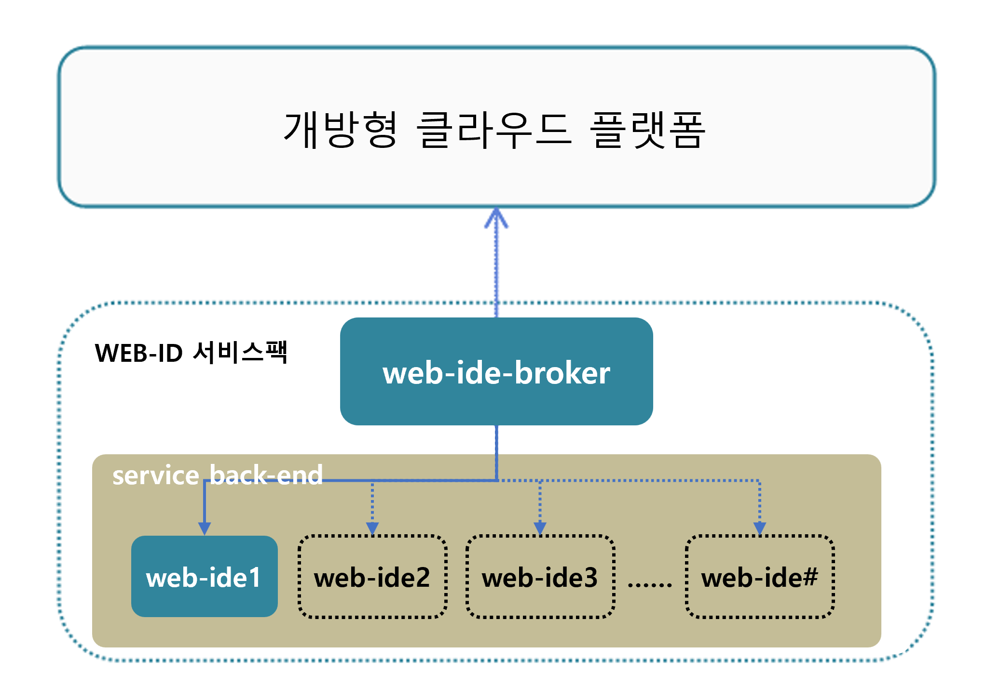

### [Index](https://github.com/PaaS-TA/Guide/blob/master/README.md) > [AP Architecture](../README.md) > WEB IDE Service

## 목적
본 문서는 Application Platform (AP) - WEB IDE Service의 Architecture를 제공한다.
  

## 시스템 구성도

 

| 구분  | 스펙 |
|-------|-----|
| eclipse-che | 2vCPU / 8GB RAM |
| mariadb | 1vCPU / 2GB RAM / 10GB 추가 디스크 |
| webide-broker | 2vCPU / 4GB RAM |

### [Index](https://github.com/PaaS-TA/Guide/blob/master/README.md) > [AP Architecture](../README.md) > WEB IDE Service
